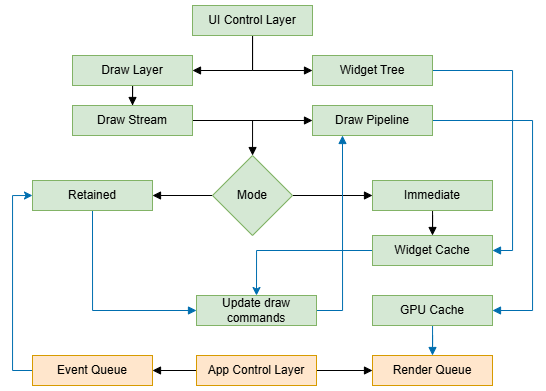

# App3D UI Kit

**Auik** is a GPU-oriented, event-driven UI runtime.
It combines Retained and Immediate execution models inside a deterministic, pipeline-oriented architecture fully controlled by the host application.

Auik is not a windowing framework and does not own your main loop.
It is a rendering and state runtime that integrates into existing engines and toolchains.

## Core Principles

- **Event-Driven Execution**  
  UI state changes only in response to injected events. No implicit polling or hidden frame logic.
- **App-In-Control Philosophy**  
  The host owns:
  - the window
  - the event loop
  - synchronization
  - GPU submission timing
- **Deterministic Data Flow**  
  UI processing is structured as a directed pipeline:  
  control -> state -> draw streams -> GPU execution.
- **Explicit Resource Ownership**  
  UI state, cached geometry, and GPU buffers have clear, non-overlapping lifetimes.
- **Backend Agnosticism**  
  Backend-specific rendering state is encapsulated inside `DrawPipeline`, allowing the UI runtime to remain independent of the underlying graphics API.

## Features

- **Hybrid Retained + Immediate Runtime**  
  Both execution models coexist and share the same rendering and caching infrastructure.
- **GPU-Centric Rendering Pipeline**  
  Draw data is prepared as structured GPU streams designed for minimal state changes.
- **SDI (Single Draw Instancing)**  
  Optimized to reduce draw calls and pipeline switches across complex UI hierarchies.
- **Hierarchical Draw Layers**  
  Explicit multi-layer composition with deterministic ordering and subpass control.
- **SDF-Based Rendering**  
  Resolution-independent rendering for shapes and borders.
- **Professional Typography**  
  True text shaping and layout powered by HarfBuzz.

## Architecture Overview

Auik v2 implements a decoupled, pipeline-oriented architecture separating:

- **Control Flow** (events, interaction, widget state)
- **Data Preparation** (draw streams, layout, style resolution)
- **Execution** (GPU pipelines, render queue submission)

The system avoids implicit redraw models and instead prepares structured GPU-ready data.



### Retained Streams

Used for persistent UI elements.

- Widget state is stored explicitly.
- Draw commands are regenerated only when relevant state changes occur.

### Immediate Streams

Allows frame-local UI declaration.
Unlike traditional immediate-mode UI systems:

- Auik does not blindly recompute everything each frame.
- Layout, geometry, and style resolution are internally cached.
- Immediate usage does not imply linear performance penalties.

Both execution paths share the same `DrawStream` and GPU pipeline infrastructure.

### Host Integration

Auik follows a strict **App-In-Control** philosophy.

The library does not:

- create or manage windows
- own the event loop
- perform implicit frame synchronization

Instead:
1. The host injects raw events into Auik.
2. Auik mutates widget state.
3. The host explicitly triggers command update.
4. Draw streams are submitted through the active GPU backend.

This design allows tight integration into existing engines.

### Hardware Abstraction Layer (HAL)
The HAL defines a clean boundary between UI logic and the graphics backend.

### Draw Streams
Typed GPU-friendly buffers containing:

- geometry
- instance parameters
- draw command metadata

They act as the primary contract between UI logic and rendering.

### Draw Pipeline
Encapsulates backend-specific state:

- shader bindings
- descriptor layouts
- pipeline configuration

UI logic remains identical regardless of the graphics API.

### GPU Caching Strategy

To minimize host-to-device traffic:

- Geometry and instance data are cached.
- Buffers are reused across frames.
- Updates are localized to mutated regions.

The render queue collects tasks from draw layers and dispatches them to the active draw pipeline.

## Theme and styling
Auik provides a declarative theme system inspired by CSS-like cascading, resolved explicitly during build/update stages.

Styles can be linked by:
- widget tag
- widget ID
- parent hierarchy
- global defaults

Style properties are divided into inherited and non-inherited groups.

---

### Non-Inherited properties
| Property         | Description                         |
|------------------|-------------------------------------|
| padding          | The padding of the widget.          |
| margin           | The margin of the widget.           |
| background_color | The background color of the widget. |
| border_color     | The border color of the widget.     |
| border_radius    | The border radius of the widget.    |
| border_thickness | The border thickness of the widget. |
| corner_mask      | The corner mask of the widget.      |

### Inherited properties:
| Property   | Description                   |
|------------|-------------------------------|
| text_color | The text color of the widget. |

---

The Theme API supports named style values stored in a typed key-value registry.

## Configuration and session history
Auik supports:

- persistent window layout
- widget configuration
- enabled/disabled states

Configuration is stored as a UMBF data block and can be embedded into UMBF files.

## Building

Auik is distributed as a CMake project and is intended to be integrated as a submodule.

Before adding the subdirectory, define:

| Option                    | Description                  | Supported values |
|---------------------------|------------------------------|------------------|
| `AUIK_GPU_BACKEND`        | GPU backend                  | `VULKAN`         |
| `AUIK_WINDOW_BACKEND`     | Window backend               | `AWIN`           |
| `AUIK_SHADERS_OUTPUT_DIR` | Output directory for shaders | `<path>`         |

> [!NOTE]
> The Vulkan backend is built on top of the **agrb** abstraction layer.  
> If you need to work with native Vulkan handles, use the Vulkan-to-agrb adapter provided by the agrb library.
>
> Auik also provides a helper function (`initialize_agrb_adopted_device`) that configures agrb with UI-specific defaults (descriptor pools, resource counts, etc.) for seamless integration. To enable this mode, define `AUIK_BACKEND_AGRB_ADOPTED`.

### Supported compilers:
- GNU GCC
- Clang

### Supported OS:
- Linux
- Microsoft Windows

### Bundled submodules
The following dependencies are included as git submodules and must be checked out when cloning:
- [acbt](https://github.com/app3d-public/acbt)
- [acul](https://github.com/app3d-public/acul)
- [awin](https://github.com/app3d-public/awin)
- [amal](https://github.com/app3d-public/amal)
- [agrb](https://github.com/app3d-public/agrb)
- [umbf](https://github.com/app3d-public/umbf)

## Minimal Initialization Example
To build the demo module, enable the following CMake option:
```cmake
set(AUIK_DEMO_ENABLE ON)
```
`AUIK_DEMO_ENABLE` builds the optional demo module and is not required for production integration.
```cpp
   auik::v2::init_agrb_dispatcher();
   // auik::v2::init_awin_dispatcher();
   auik::v2::CreateInfo create_info;
   create_info.set_ed(&env::get_event_dispatcher())
      .set_disposal_queue(&env::get_disposal_queue())
      .set_gpu_backend(&env::get_device())
      .set_frames_in_flight(FRAMES_IN_FLIGHT);
   auik::v2::init_library(create_info);
   auik::v2::DrawLayer *layers = acul::alloc_n<auik::v2::DrawLayer>(1);
   layers[0].subpass = 1;
   layers[0].stream_count = 1;
   layers[0].streams = acul::alloc_n<auik::v2::DrawStream>(1);
   auik::v2::create_quads_stream_retained(layers[0].streams[0]);
   auik::v2::set_default_quad_stream(&layers[0].streams[0]);
   // agrb::graphics_pipeline_batch batch;
   // // todo: pipeline cache
   // // todo: add ui pipeline artifacts/commits
   // if (!batch.allocate_pipelines(env::get_device(), 1))
   //     throw acul::runtime_error("Failed to allocate ui pipelines");
   auik::v2::set_theme(auik::v2::create_default_theme());
   auik::v2::add_demo_window();
   // todo: record primary commands, update layout, update styles
```

## License
This project is licensed under the [MIT License](LICENSE).

## Contacts
For any questions or feedback, you can reach out via [email](mailto:wusikijeronii@gmail.com) or open a new issue.